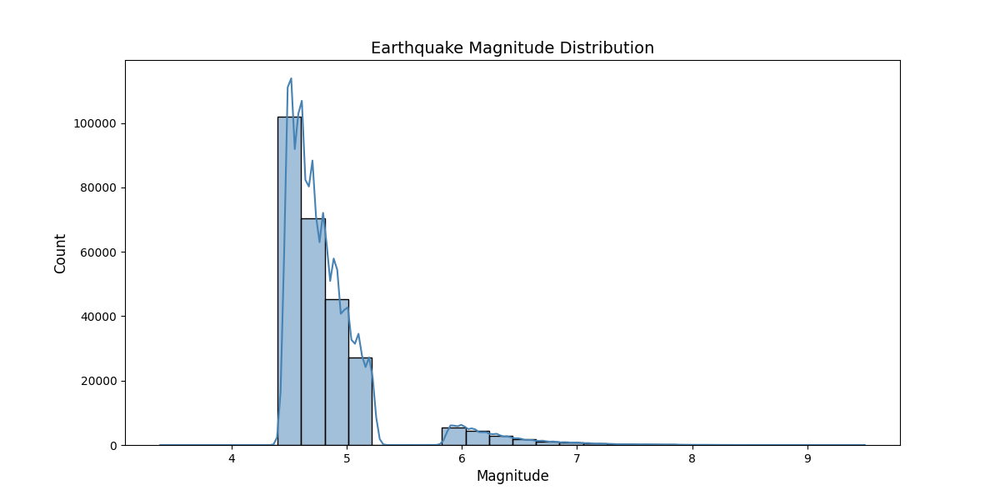
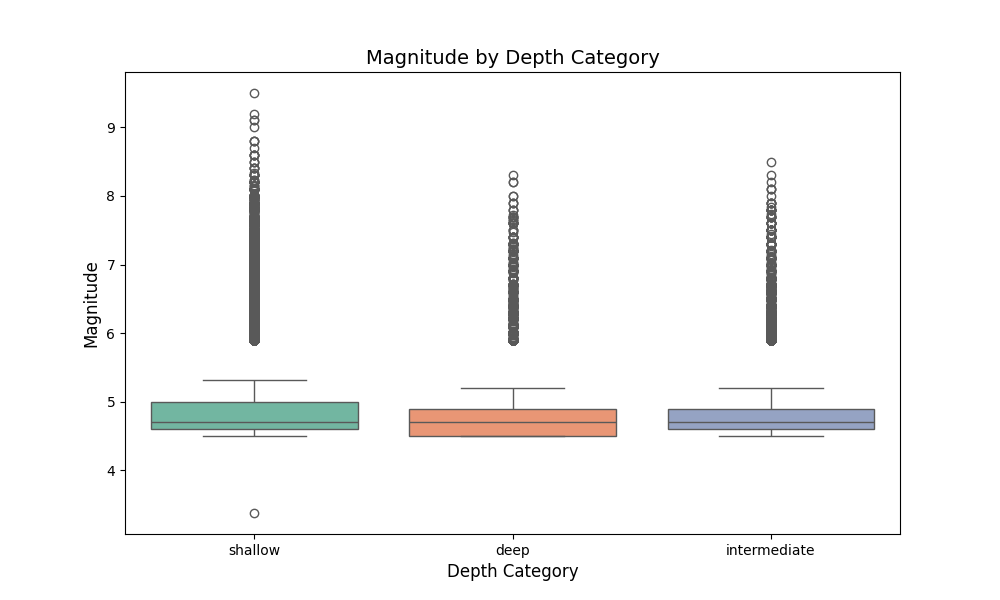
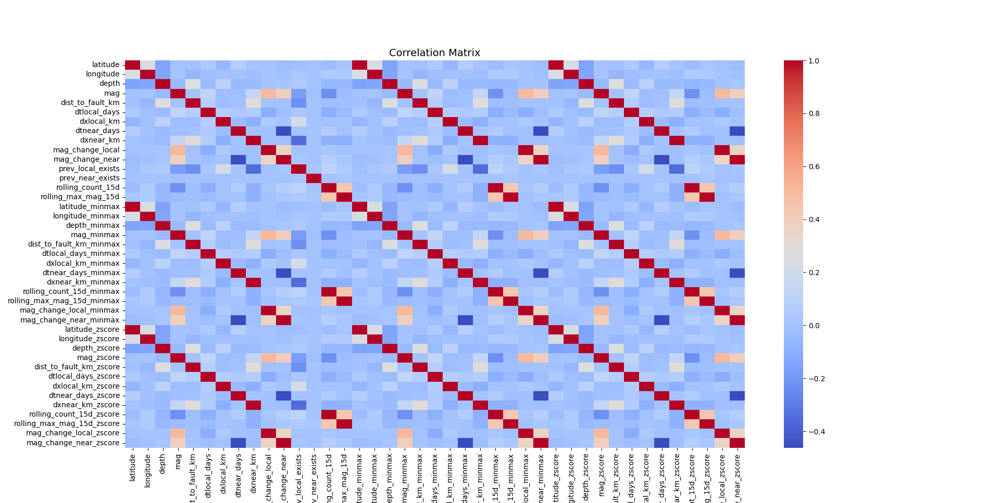
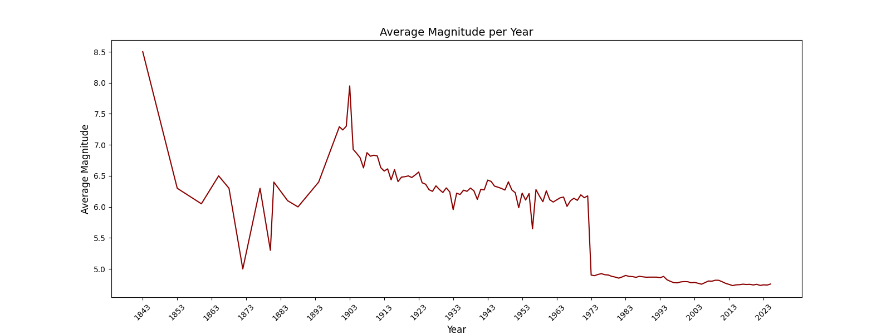
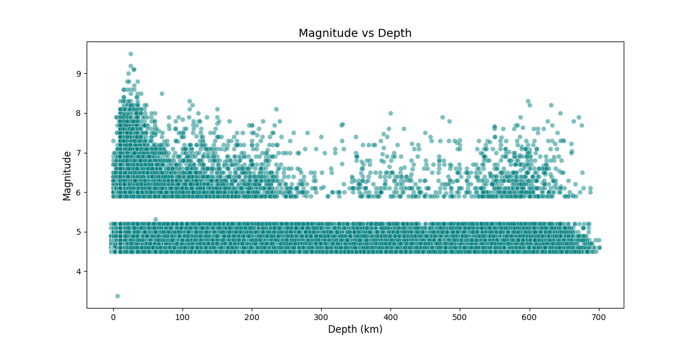
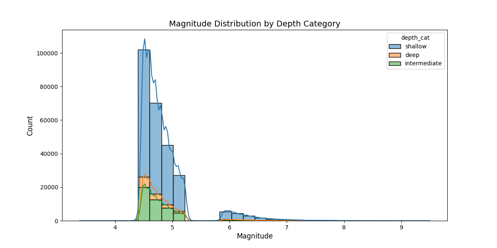

# 🌍 Earthquake DATASET – Seismic Data Analysis & Prediction

This project analyzes global earthquake data (4.5+ magnitude) from **1843-02-08** to **2025-09-21**.  
The dataset is preprocessed for machine learning models to explore temporal and spatial earthquake patterns.

---

## 📂 Dataset Information
---
- **Original dataset size**: ~180 MB  
- **Reason for split**: GitHub limits file uploads to 100 MB  
- **Solution**: Dataset was split into **8 parts (~24 MB each)**  
- **Location**: [`/dataset1/parts/`](./dataset1/parts/)  

Each part includes the header row for easier handling.  
To merge them back into a single file:

```bash
# Linux / Mac
cat part_*.csv > eqdata_preprocessed.csv
```
```PowerShell
# Windows PowerShell
Get-Content part_*.csv | Set-Content eqdata_preprocessed.csv
```
📊 Dataset Overview
---
Total rows: 262,188
Columns: 43
Magnitude range: 4.5 – 9.5
Depth categories: shallow, intermediate, deep
Example columns:
time – Date and time of the earthquake
latitude, longitude, depth, mag
dist_to_fault_km – Distance to nearest fault
rolling_count_15d – Rolling window counts
mag_change_local, mag_change_near – Magnitude change features
Normalized and z-scored versions for ML models
📄 Dataset Columns
---
time – Timestamp of the earthquake (UTC)

latitude – Latitude of the epicenter

longitude – Longitude of the epicenter

depth – Depth of the earthquake in km

mag – Magnitude of the earthquake

depth_cat – Depth category (shallow, intermediate, deep)

dist_to_fault_km – Distance to nearest fault line (km)

dtlocal_days – Days since previous local earthquake

dxlocal_km – Distance from previous local earthquake (km)

dtnear_days – Days since previous nearby earthquake

dxnear_km – Distance from previous nearby earthquake (km)

mag_change_local – Magnitude difference from previous local earthquake

mag_change_near – Magnitude difference from previous nearby earthquake

prev_local_exists – Boolean flag if a previous local earthquake exists

prev_near_exists – Boolean flag if a previous nearby earthquake exists

rolling_count_15d – Number of earthquakes in the past 15 days

rolling_max_mag_15d – Maximum magnitude in the past 15 days

latitude_minmax – Min-max normalized latitude

longitude_minmax – Min-max normalized longitude

depth_minmax – Min-max normalized depth

mag_minmax – Min-max normalized magnitude

dist_to_fault_km_minmax – Min-max normalized distance to fault

dtlocal_days_minmax – Min-max normalized local time gap

dxlocal_km_minmax – Min-max normalized local distance gap

dtnear_days_minmax – Min-max normalized nearby time gap

dxnear_km_minmax – Min-max normalized nearby distance gap

rolling_count_15d_minmax – Min-max normalized rolling count (15 days)

rolling_max_mag_15d_minmax – Min-max normalized rolling max magnitude (15 days)

mag_change_local_minmax – Min-max normalized local magnitude change

mag_change_near_minmax – Min-max normalized nearby magnitude change

latitude_zscore – Z-score standardized latitude

longitude_zscore – Z-score standardized longitude

depth_zscore – Z-score standardized depth

mag_zscore – Z-score standardized magnitude

dist_to_fault_km_zscore – Z-score standardized distance to fault

dtlocal_days_zscore – Z-score standardized local time gap

dxlocal_km_zscore – Z-score standardized local distance gap

dtnear_days_zscore – Z-score standardized nearby time gap

dxnear_km_zscore – Z-score standardized nearby distance gap

rolling_count_15d_zscore – Z-score standardized rolling count (15 days)

rolling_max_mag_15d_zscore – Z-score standardized rolling max magnitude (15 days)

mag_change_local_zscore – Z-score standardized local magnitude change

mag_change_near_zscore – Z-score standardized nearby magnitude change

📷 Visualizations
---
1. Earthquake Magnitude Distribution 


2. Magnitude by Depth 


3. Correlation Matrix 


4. Average Magnitude per Year 


5. Magnitude vs Depth 


6. Magnitude Distribution by Depth Category 


⚙️ How to Use
Clone the repository:

```bash
git clone https://github.com/CevherOmer/earthquake_dataset.git
cd earthquake_dataset
Install dependencies:
```

```bash
python data.py
(Optional) Train or load ML models using the prepared dataset.
```
📌 Notes
This repository is mainly for data analysis & visualization.

Earthquake prediction is a highly complex task; the provided models are experimental.

Dataset can be extended with additional seismic or geophysical data for better modeling.

📜 License
MIT License – feel free to use, modify, and share with attribution.

---

## 👤 Author

**Omer Cevher** – [GitHub Profile](https://github.com/CevherOmer)

